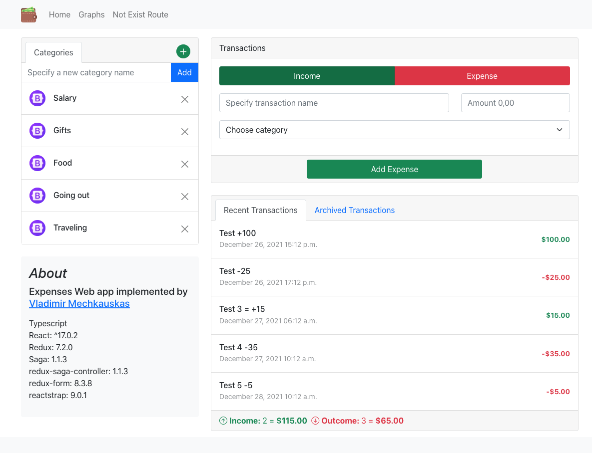

The task is to create an income/expense web app. The app should have two screens. The app should be written using the technologies mentioned in the Technologies section.
Successful candidates spend on average 4 hours on this task.

## Data layer

There are two entities in the app: Category and Transaction

### Category

Represents one category of transaction. As examples of categories: Salary, Gifts, Food, Going out, Traveling. There must be pre-defined categories in the app from the beginning (3-5 is enough).

Should have following fields

- id
- label

### Transaction

Should have following fields

- id
- label
- date
- amount (negative value means expense, positive value means income)
- category (reference by category id)

## Screens

### Home

This is the default screen and app entry point. This screen should have a table of transactions and a form for adding a new transaction. Users should not be able to remove transactions. Also, on this screen, there should be a list of categories with the ability to add/remove categories. It's up to you to decide what happens to transactions in category when the category gets deleted.

### Graph(s)

This screen should have a graph or multiple graphs to represent the data. It's up to you to decide how exactly to visualize the data. To give you an example: a graph representing total spends per category.

## Technologies

- Typescript
- SCSS Modules
- React version 16.8 and up, please make sure to use Hooks
- Redux version compatible with React version of choice
- Use `localStorage` as a DB for the app

Usage of any additional libraries, such as react-router is allowed.

## How to participate

There are 3 simple steps

1. Fork this repository
2. Complete the task in your repository
3. Create a PR to this repository

Afterwards we will contact you, please make sure you have contact details in your GitHub profile.

Tip: you can [deploy your application](https://www.freecodecamp.org/news/deploy-a-react-app-to-github-pages/) for demo on github pages for free

Happy coding 🚀
